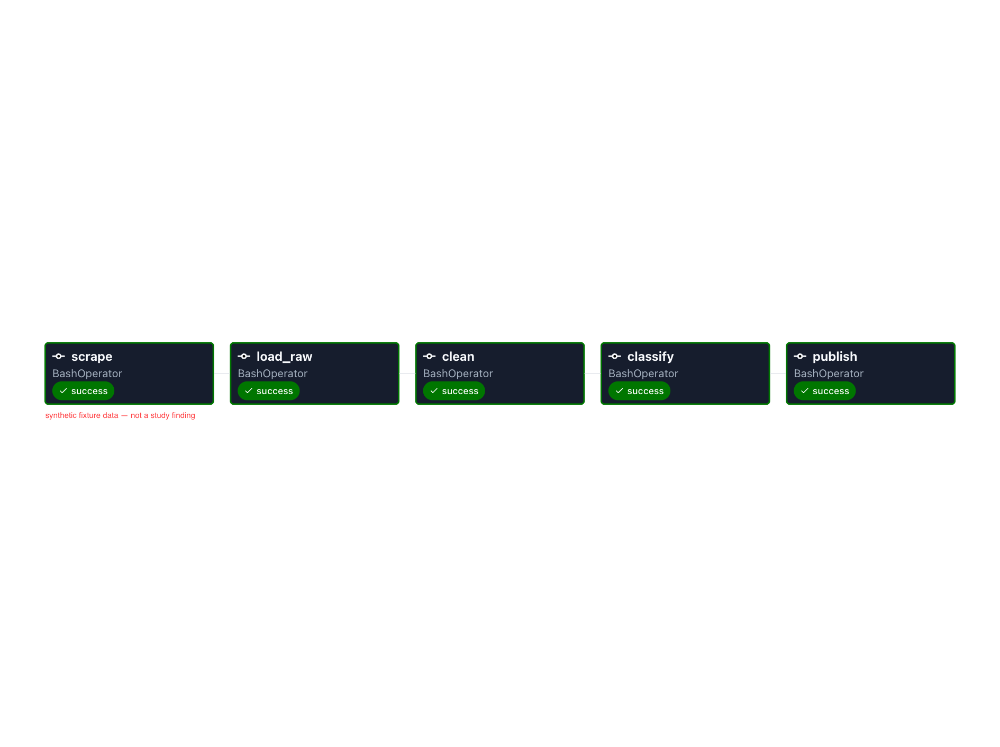

# The Airflow demonstration — the five steps as a scheduler runs them

The study rebuilds with one command on a laptop. This page shows the same five
steps the way a company would schedule them: one Airflow DAG, five boxes in a
row, each running one `make` command. It is developer-run and not part of CI —
CI has no Docker.

**What you see here is a demonstration of the mechanism over hand-written
synthetic reviews: synthetic fixture data — not a study finding.** The container
loads `ROWS=synthetic` from its environment, so every table the run builds holds
fake reviews; the screenshot committed in [`screenshots/`](screenshots/) shows
task names and states only.

## What it shows

- **The DAG** — [`friction_ledger.py`](friction_ledger.py): five tasks in the
  brief's order, `scrape → load_raw → clean → classify → publish`, each one
  `make` target run from the repo root, chained with arrows. No function, no
  branch, no SQL: the file is a list of commands, so it fits on one screen and
  the same commands run by hand (`make help`).
- **The three middle tasks** are the three stages of the one rebuild —
  `make rebuild STAGE=load|clean|classify` — into the same warehouse file, so
  the stages and the whole share every function (`tests/test_rebuild.py` pins
  that they leave the same counts, table for table).
- **`publish`** writes the file the Metabase demonstration reads
  (`make publish`, [`../study/metabase/DEMONSTRATION.md`](../study/metabase/DEMONSTRATION.md)).
  The permanent HTML page is not rewritten by a DAG run: the repo is mounted
  read-only.

*Under the hood.* The container ([`Dockerfile`](Dockerfile),
[`docker-compose.yml`](docker-compose.yml)) is the official Airflow image on its
Python-3.12 variant plus `make` and `uv`, running `airflow standalone` — the
scheduler, the DAG processor, the API server and the executor in one process over Airflow's
bundled SQLite metadata database. The tracked paths the tasks read (the four
project files and nine packages) are each mounted read-only, and no other
top-level entry of the checkout is in the container — not `.env`, not `.git/`,
not the local tool config (a package's own bytecode cache rides along with the
package, read-only). `data/` is a container-private volume with the three
tracked, numbers-only subtrees bound read-only inside it. So the `classify`
task is the no-key run, and no credential is in the container. `uv` resolves the project from the
lock into its own environment on the first task (network once).

## The walk

```
cd dags && docker compose up --build            # builds the image the first time
docker compose logs airflow | grep -i password  # the generated admin login
open http://127.0.0.1:8080                      # log in as admin, open friction_ledger
```

Trigger the DAG with the play button and watch the grid: `scrape` runs the
polite fetch (robots first, two seconds between requests, at most sixty pages per
source — its captures stay in the volume, unloaded under `ROWS=synthetic`);
`load_raw`, `clean` and `classify` build the synthetic warehouse stage by stage;
`publish` writes the Metabase export into the volume. Five green boxes is the
demonstration. If another container already holds port 8080 on your machine,
change the host side of `ports:` in the compose file.

When done: `docker compose down -v` removes the container and its volume. The
host's `data/`, the tracked page and every other file are untouched by
construction — every mount from the checkout is read-only.

## Screenshot

Every table behind this grid holds hand-written fake reviews (`ROWS=synthetic`,
as the opening says); the grid itself shows task names and states, nothing else.
The image carries the caption *synthetic fixture data — not a study finding* in
its pixels and in its text metadata, so it says so wherever it travels.

*Capturing it (a developer step, as in the Metabase demonstration).* Screenshot
the DAG's grid with the five tasks green, add the caption as a text band in the
pixels (any image editor), then write it into the PNG's own text channel, the
same `Comment` chunk the Metabase screenshots carry, so the suite's reader and
`make check-docs` see it:

```
exiftool -Comment="synthetic fixture data — not a study finding" -overwrite_original dags/screenshots/01-dag-run.png
```

`tests/test_dag.py` then passes: it reads the doc's alt text and the PNG's text
chunks for the caption, and stays red until the file lands.


