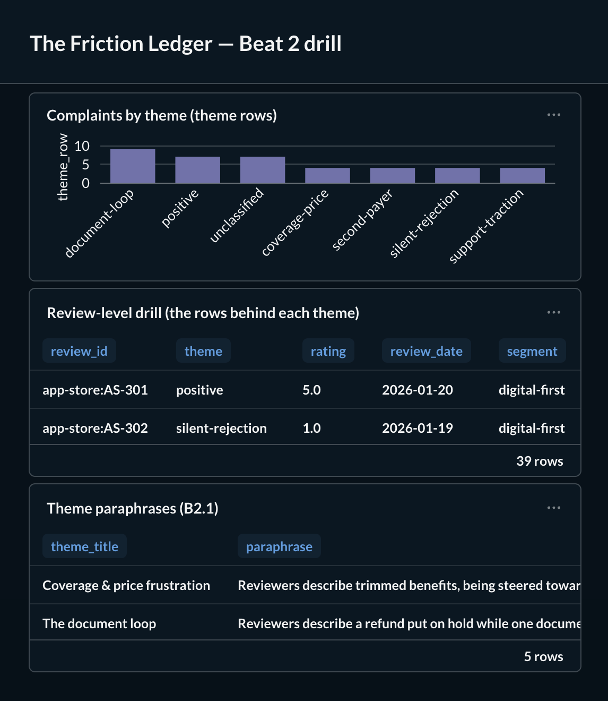
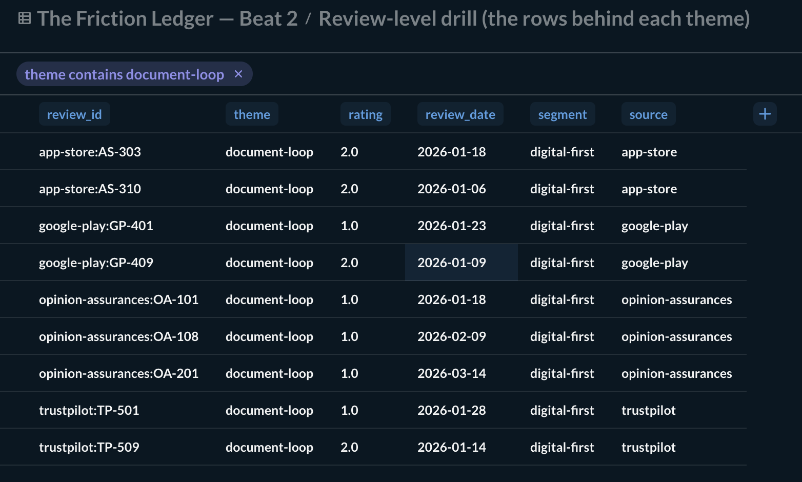
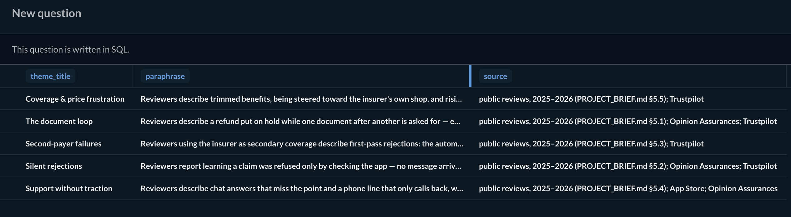

# The Metabase demonstration — the review-level drill

This is the study's third surface. The permanent HTML page
(`study/friction_ledger.html`) and the README tell the five beats and can be read
by anyone with no accounts. This surface is the one you *click*: a theme bar opens
to the individual reviews counted under it, over your own rebuild. It is
developer-run and not part of CI — CI has no Docker.

**What you see here is a demonstration of the mechanism, over hand-written
synthetic reviews: synthetic fixture data — not a study finding.** The real
counts come from your own `make rebuild ROWS=captured`; the screenshots committed
in [`screenshots/`](screenshots/) are captured over `ROWS=synthetic` so no real
review can appear.

## What it shows

- **Theme share** — how many reviews carry each of the five complaint themes
  (plus *positive* and the gray *not yet classified* band). This is the drill's
  entry point.
- **The drill** — pick a theme and see the individual review rows counted under
  it: a stable id, the theme, the rating, the review's own date, its segment and
  the platform. Never the review's own words and never a per-review web address —
  the drill view carries only that non-text allowlist, so nothing more can reach
  the screen. The audit trail is the counted rows, not quoted excerpts (no source
  gives a per-review public address — see the README's note and DECISIONS → D1).
- **The paraphrase** — what each theme *means*, in one Documented, sourced
  paraphrase (B2.1, [`../paraphrases.yaml`](../paraphrases.yaml)): our words, not
  a reviewer's, always with the public source it paraphrases.

## Screenshots

Every review shown is hand-written (`ROWS=synthetic`, as the opening says); the
drill carries only the non-text allowlist, so no review body or brand address can
appear.

The dashboard: the theme-row bar, the review-level drill, and B2.1's paraphrases.



Drilling one theme (`document-loop`) to the review rows behind it — a stable id,
theme, rating, the review's own date, segment and platform; never its words, never
a per-review address.



B2.1's five theme paraphrases, each in our words with its public source.



## Run it

From the repository root:

```
make rebuild ROWS=captured                        # your own corpus
uv run python -m study.metabase export            # writes data/metabase/metabase.sqlite
cd study/metabase && docker compose up -d
cd ../.. && uv run python -m study.metabase apply  # provisions from config.yaml; reads .env
open http://localhost:3000
```

`export` reads the corpus (`captured`) by default; the committed screenshots are
captured over the synthetic fixture instead, so no real review can appear —
`make rebuild ROWS=synthetic && uv run python -m study.metabase export --rows synthetic`.
`export --rows` takes the same closed set as `make rebuild` (`captured`, `none`,
`synthetic`, `samples`).

`apply` reads your Metabase login from `.env` (`METABASE_URL`, `METABASE_USER`,
`METABASE_PASSWORD`) and upserts the dashboard by name, so running it twice
changes nothing. `apply --dry-run` prints the request bodies without a network
call or credentials.

### Under the signpost — how the pieces fit

`export.py` copies the marts into a SQLite file (`data/metabase/metabase.sqlite`) that
Metabase reads with its **built-in** SQLite driver — no third-party driver JAR,
so the stack stays a laptop with no extra downloads. `config.yaml` describes the
database connection, the three questions (native SQL over the exported tables)
and the dashboard as data; `apply.py` turns that into HTTP-API calls. Editing
`config.yaml`, not the Metabase UI, is how the dashboard changes — the config is
the source of truth, re-appliable and reviewable.

The exported `rating` is written as a fixed one-decimal string, so a `4.3`
never drifts to `4.2999…` on the way through SQLite; the export is
byte-identical on a rerun.

A word on what the numbers mean. Over `ROWS=synthetic` (the committed
screenshots) every count is fixture data. Over your own `ROWS=captured` rebuild
they are your corpus's real counts — Measured, at the review × theme grain (a
review with two themes counts in two bars). Metabase is an exploration surface,
not the study's tagged presentation: the tags (Measured / Documented / Modeled /
Pending) and the gated, byte-checked figures live on the HTML page and in the
marts' own provenance. Read a Metabase count as "how many rows the classifier put
here", and cross-check the study's claims against the page.
